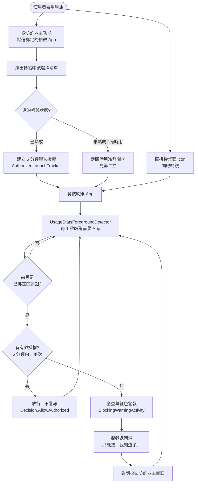
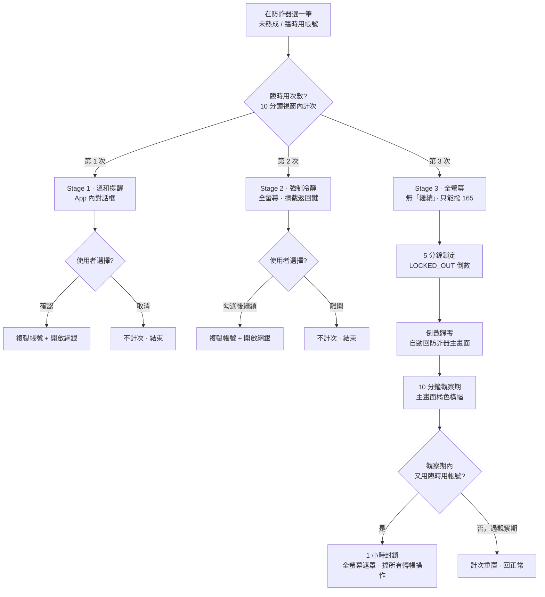

# 防詐器主功能 — 警報與冷靜流程

> 範圍：僅「防詐器」主功能。不含 詐騙專區 / 設定 分頁。

---

## 一、前景偵測警報

核心：偵測到**未經防詐器授權**就開啟綁定的網銀 App → 蓋出全螢幕警告。

**成立前提（圖未畫）：**

- 服務需運行 —— 已綁定 ≥1 個 App
- 偵測需「使用情況存取權 + 上層顯示」兩項權限齊全，缺一即無法偵測

**判讀重點：**

| 路徑 | 結果 |
|---|---|
| 從防詐器選「已熟成」帳號進網銀 | 帶 5 分鐘授權 → 偵測時放行，不警報 |
| 直接從桌面開網銀 | 無授權 → 觸發全螢幕警報 |
| 授權過期（超過 5 分鐘或已用過）後又回到網銀 | 無有效授權 → 再次警報 |

判決由 `ForegroundAppGuard` 產出三種：`Ignore`（非綁定 App）、`AllowAuthorized`（有授權）、`BlockUnauthorized`（觸發警報）。

---

## 二、臨時用帳號冷靜關卡

當使用者在防詐器內選了一筆**尚未熟成（加入未滿約 24 小時）**的帳號，不直接放行，改走階梯式冷靜流程。次數以「10 分鐘視窗」計算。

**階梯摘要：**

| 階段 | 畫面 | 可否繼續 |
|---|---|---|
| 第 1 次 | App 內提醒對話框 | 可（取消不計次） |
| 第 2 次 | 全螢幕強制冷靜 `TempUseGateActivity` | 勾選確認後可繼續 |
| 第 3 次 | 全螢幕，只能撥 165 | 不可，觸發 5 分鐘鎖定 |
| 鎖定後 | 5 分鐘倒數，歸零自動回主畫面 | — |
| 觀察期 | 主畫面 10 分鐘橘色橫幅 | 期間再犯 → 1 小時封鎖 |
| 封鎖 | 全螢幕遮罩，擋所有轉帳操作 | 1 小時內不可 |

> 通過 Stage 1/2 後仍以 `launchAuthorized` 建立 5 分鐘授權再開網銀，因此第一節的前景偵測會放行、不重複警報。

---

## 名詞對照

| 名稱 | 說明 |
|---|---|
| 已熟成帳號 | 加入超過約 24 小時，可直接複製、直接用 |
| 臨時用帳號 | 加入未滿約 24 小時，使用須走第二節冷靜關卡 |
| 單次授權 | 從防詐器進網銀時建立，5 分鐘、用過即失效 |
| 前景偵測 | `UsageStatsForegroundDetector`，每 1 秒輪詢 |
